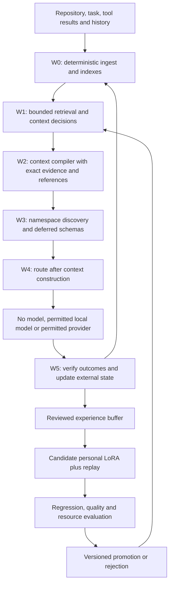

# Wrench v2: Layer 1 context runtime and adaptive LoRA

Status: experimental design, not an implemented v2 product.

## Two meanings of layer

Wrench is the **Layer 1 runtime before downstream reasoning**. Its controller
has three weight components: frozen Qwen, frozen Wrench-Core LoRA and a
replaceable personal Continuous LoRA. W0 through W5 are processing stages.



## Runtime responsibilities

| Stage | Mechanism and output | Safety and evidence |
| --- | --- | --- |
| W0 ingest | Incremental Tree-sitter syntax, LSP/SCIP where available, git/diff/test parsers, lexical/BM25 plus optional embeddings, bounded local state | Snapshot identity and parser/index coverage; lexical edges are not resolved semantic references |
| W1 controller | Task type, ranked IDs, graph expansion, enough/retrieve-more, context budget, candidate namespaces | Finite typed decisions over known IDs; bounded hops/bytes/attempts; abstain on unsupported/uncertain output |
| W2 compiler | Exact hot evidence, structural warm context, compressed cold material, retrieval handles | Source ranges/hashes, pinned originals, exact serialized-token count, omissions and stale-handle failures |
| W3 gateway | Small discovery surface, namespace search, needed schemas, deterministic transformations | Schemas are inert metadata and grant no authority; the registry does not enforce permissions. A deterministic host-owned policy must authorize each action at the dispatch boundary and fail closed when policy or identity is missing or invalid |
| W4 router | No-model/local/authorized provider after normalization; outcome probability, cost/latency, future steps and cache state | Learned production routing disabled until validated; scores cannot grant authority/spend |
| W5 digester | Verify outcomes, record facts, update indexes, compact history, retain originals and learning candidates | Preserve user instructions/trust levels; independently supported labels |

Use lexical names first, then BM25/semantic candidates, bounded graph expansion,
reranking, diversity/dependency coverage and budgeted packing. RETRIEVE_MORE
requests a bounded permitted lookup, not an arbitrary loop. Freeze per-request
caps and stop on exhaustion.

Hot context includes user-specified code, active functions/diffs and current
failure lines/errors. Keep it lossless. Warm context uses signatures,
dependencies and related tests. Compress cold repetitive output/history with
access to originals. If hot content exceeds budget, use a larger permitted
context or escalate; never silently omit it.

Keep stable instructions/schema prefixes, then session information, then
dynamic evidence and deferred schemas. Record cache behavior. Compression
that invalidates useful caches may worsen total latency/cost.

## Model and the three weight components

The candidate is post-trained `Qwen/Qwen3.5-0.8B`, pinned in
[model-candidate.json](model-candidate.json). Here "base" means the frozen
foundation; it does not silently select the separate `-Base` repository.
The checkpoint includes vision weights. Initially use text and budget the
complete snapshot.

For a targeted linear layer, intended composition is:

```text
W_effective = W_frozen + s_core B_core A_core + s_personal B_personal A_personal
```

Bind compatible target modules, ranks, scales, tokenizer and backbone revision
to adapter hashes. The equation is a requirement, not proof that a backend
activates both adapters correctly or freezes the core during fitting.
Demonstrate numerical composition, frozen-parameter, save/load and rollback
parity on the actual runtime before training.

| Part | Changes when | Contents |
| --- | --- | --- |
| Qwen foundation | Explicit version migration | General capabilities; immutable original files |
| Wrench-Core LoRA | Curated product release | Shared retrieval/context/toolbelt/route habits; frozen during use |
| Continuous LoRA | Evaluated background consolidation | Local behavioral preferences from verified experience |

The input-note estimates of 5-20M core and 0.5-5M personal parameters are
hypotheses. Calculate actual trainable parameters and checkpoint/optimizer bytes
from modules/rank. No latency or sub-2-GB memory promise follows from the
1.77 GB snapshot: runtime also needs activations, cache and framework memory.

Keep adapters separately immutable. Never merge into the sole foundation
copy. V1's binary readout may remain an ablation; it cannot substitute for the
complete v2 controller.

## Decision tasks and packet format

Train bounded outputs: candidate symbol/evidence ranking; ENOUGH or
RETRIEVE_MORE; permitted graph expansion; compression policy; namespace IDs;
permitted route ID; accept/verify/escalate. Classification, reranking and
constrained generation are implementation choices to compare.

A packet includes goal/current intent; accepted decisions; snapshot identity;
source IDs/ranges/hashes; evidence/dependencies; omissions and artifact
handles; namespaces; context budget and routing features. Untrusted source
and tool results cannot override policy, instructions or consent.

Mutable facts such as current references, paths, test counts and model
availability belong in external state. Learn which evidence tends to help,
rather than encoding changing facts as weight-level truth.

## Continual learning lifecycle

1. Record permitted state, chosen/rejected evidence, route, later retrieval,
   corrections and verified outcomes. Local by default. Opt-in capture and a
   delete/reset path are required before product rollout.
2. Admit reviewed examples with rights/consent, redaction, lineage and reliable
   labels. Teacher disagreement is a candidate signal; later success alone
   may not identify which prior choice caused a failure.
3. Accumulate without per-token training. Fit one new personal candidate in a
   bounded background batch. Freeze base/core; serving keeps its active version.
4. Mix recent, historical, correction and invariant examples. The notes'
   40/30/20/10 replay mix and weighting are development hypotheses. Replay can
   mitigate forgetting, never guarantee safety.
5. Evaluate core regression, fresh temporal/repository/task-group holdouts and
   relevant personal tasks. Count failed updates and training overhead.
6. Promote only when criteria pass; otherwise retain the prior adapter and
   quarantine the candidate. Follow [storage/recovery](STORAGE_AND_RECOVERY.md).
7. Reset by deactivating the personal adapter. New core versions require
   validation/retraining of personal compatibility. Filenames cannot prove it.

Start with one personal adapter; defer adapter banks. No learning may rewrite
permission policy, test oracles, thresholds, source datasets or active weights.

## Reuse and implementation status

The [source audit](../reports/wrench-v2-realignment/reuse-audit.md) maps the
surviving in-memory/lexical/AST helpers, verifier, proposals and router guards.
They do not establish a durable W0-W5 pipeline or the adapter lifecycle.
Synchronous cooperative cancellation is not hard interruption.

Build E0, then add learned decisions individually. The
[experiment](V2_EXPERIMENT.md) retains continual adaptation as required v2
work; the deterministic baseline alone cannot complete v2.
